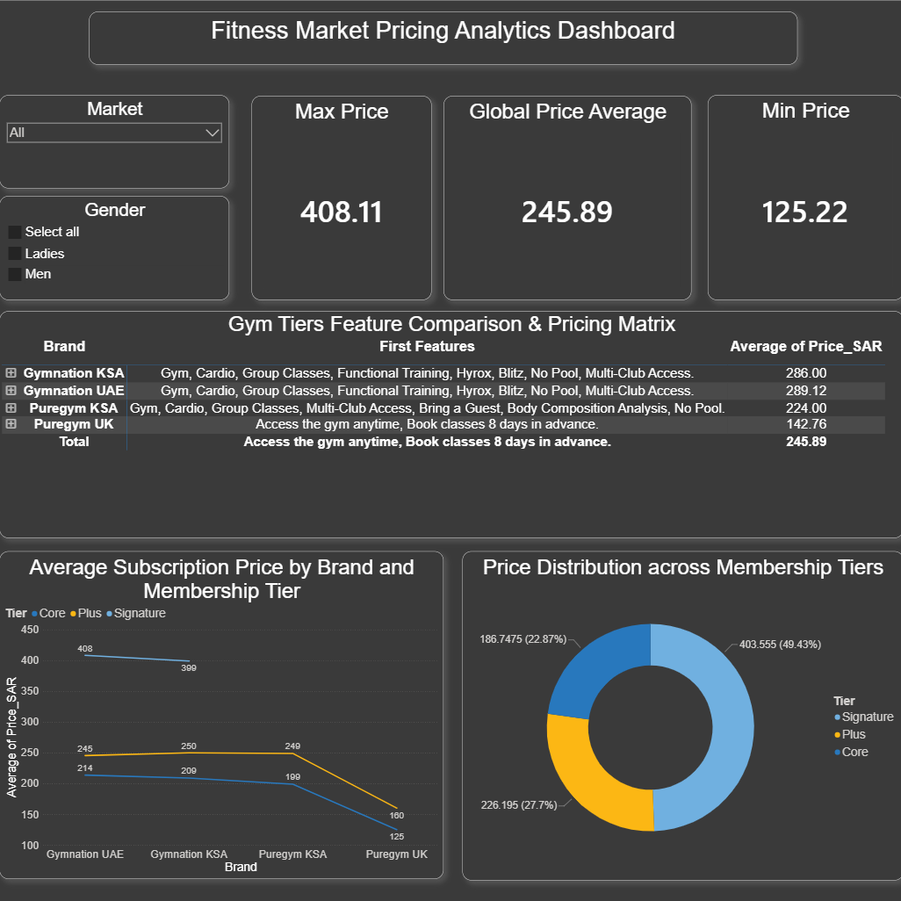

# Cross-Border Fitness Market Pricing Analytics

An end-to-end data analytics and business intelligence project exploring the structural pricing methodologies, tier architectures, and service bundling models of dominant fitness chains across different economic territories.

---

## 📊 Interactive Dashboard Preview
Here is the final executive dashboard built using Power BI. It features localized KPI cards, geographic distribution metrics, and a comprehensive cross-border feature comparison matrix.

---

## 🚀 Executive Project Summary
This project investigates the subscription frameworks of **PureGym** and **GymNation** across three economic zones: **Saudi Arabia (KSA)**, the **United Arab Emirates (UAE)**, and the **United Kingdom (UK)**. The study decodes how these operators leverage regional purchasing power and tier structuring to drive premium monetization and maximize profit margins.

### 🎯 Rationale for Brand Selection
1. **PureGym:** Selected as a global benchmark to analyze how a single massive brand adapts its pricing behavior between an established European baseline (UK) and an expanding domestic market (KSA).
2. **GymNation:** Selected as a dominant regional player in the UAE that shares the "high-value, low-cost" market philosophy, serving as a competitive benchmark for Gulf regional integration.

---

## 🛠️ Technical Methodology & Data Lifecycle

### 1. Data Cleaning & Statistical Filtering (Manual Pre-processing)
To protect data integrity and achieve a reliable, normalized "apple-to-apple" comparison, strict filtering criteria were executed during data preparation:
* **Exclusion of Off-Peak Tiers:** Entirely filtered out because time-restricted access structures artificially deflate statistical pricing averages when evaluated against standard 24/7 access plans.
* **Exclusion of Commitment Contracts:** Long-term and annual contracts were dropped to isolate flexible, month-to-month, non-commitment baselines.
* **Currency Normalization:** All foreign metrics—British Pounds (GBP) and UAE Dirhams (AED)—were **manually converted** into Saudi Riyals (SAR) using real-time baseline conversion ratios to establish a unified benchmark.

### 2. Automated Global Price Gap Analytics (Python Framework)
The data pipeline runs a robust, case-insensitive, and space-tolerant Python function to evaluate international price variances. By forcing lowercase string standardization and stripping hidden whitespace padding across `Brand` and `Tier` variables, the script programmatically isolates matching subsets to securely execute calculations.

**Empirical Analytical Findings from the Python Script:**
* **PureGym Benchmarks (KSA vs. UK):**
  * **Core Tier:** KSA is **58.9% MORE EXPENSIVE** than the UK (+73.8 SAR/mo)
  * **Plus Tier:** KSA is **55.3% MORE EXPENSIVE** than the UK (+88.7 SAR/mo)
* **GymNation Benchmarks (KSA vs. UAE - Dubai):**
  * **Core Tier:** KSA is **2.2% CHEAPER** than UAE (-4.8 SAR/mo)
  * **Plus Tier:** KSA is **1.8% MORE EXPENSIVE** than UAE (+4.5 SAR/mo)
  * **Signature Tier:** KSA is **2.2% CHEAPER** than UAE (-9.1 SAR/mo)

### 3. Business Intelligence Modeling (Power BI & DAX)
The cleaned, processed dataset was modeled into an interactive enterprise workspace using:
* **Advanced DAX Architecture:** Authored dynamic measures to capture regional indices and isolate the precise **Global Price Average** at **245.89 SAR**.
* **Visual Matrix Engineering:** Designed a dark-themed UI pairing interactive line/donut trends with a comprehensive **Gym Tiers Feature Comparison Matrix** to evaluate absolute feature utility against financial cost.

### 💡 Methodological Innovation: "Vibe Coding"
This project intentionally embraces the **Vibe Coding** paradigm. Instead of losing hours to syntax boilerplate and basic code formatting, human intellect was directed entirely toward market framing, statistical rule design, and visual optimization, while advanced LLMs drove rapid code generation, web-scraping scripts, and DAX refinement.

---

## 🧠 Core Market Insights & Pricing Strategies
* **Geographical Price Discrimination:** Operators enforce aggressive localized markups when deploying operations domestically compared to European baselines, scaling prices with regional purchasing power.
* **Tiered Pricing Framework:** Chains engineer clear entry barriers (`Core`, `Plus`, `Signature`) to efficiently minimize acquisition friction while capturing maximum consumer surplus in elite brackets.
* **Value-Based Service Bundling:** Price jumps between tiers are systematically justified by bundling high-perceived-value digital and structural add-ons (such as multi-club access and body metrics analysis).

---

## 🔮 Future Work: KSA Market Deep Dive (Phase 2 Extension)
While Phase 1 establishes the macroeconomic global baseline, a subsequent phase is planned to isolate and deeply dissect the domestic Saudi Arabian fitness ecosystem. The upcoming extension will explore:
1. **Gender-Based Pricing Variance:** Investigating potential pricing disparities between Ladies' and Men's membership segments within KSA.
2. **Utility vs. Cost Modeling:** Mapping localized service and feature bundling against subscription price appreciation.
3. **Temporal Flexibility Analytics:** Re-introducing off-peak and commitment models to decode how operators utilize time-bound availability to drive premium monetization.

---

Disclaimer: This project is exclusively for independent academic research and portfolio purposes. All data utilized in this analysis consists of publicly available subscription pricing information harvested directly from the respective brand websites.
